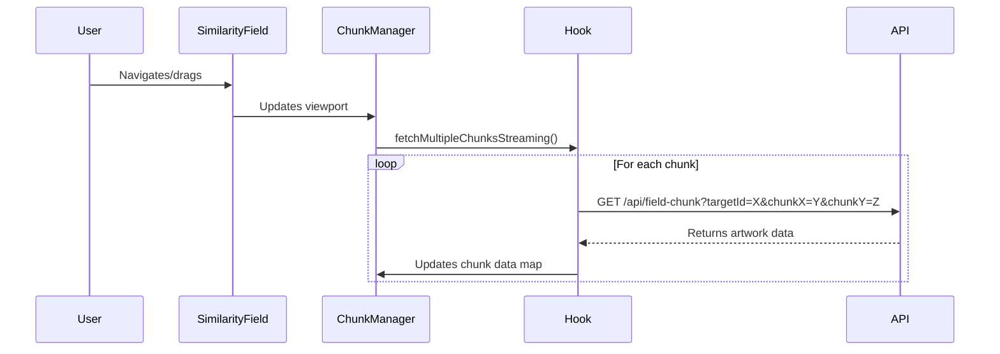

# Similarity Field API Call Specification

## Overview
The similarity field component displays a grid of artwork images similar to a focal artwork, using chunk-based loading for performance. This document details how API calls are made and identifies optimization opportunities.

## Architecture Components

### 1. API Client (`src/lib/api-client.ts`)
- **`fetchFieldChunk`**: Fetches individual chunks
- **`fetchMultipleChunks`**: Batch endpoint for fetching multiple chunks (POST request)

### 2. Data Hook (`src/components/similarity-field/hooks/useSimilarityChunkDataSimple.ts`)
- Manages chunk data fetching, caching, and deduplication
- Implements streaming/progressive loading
- Uses LRU cache with MAX_DATA_CACHE limit

### 3. Component Hierarchy
```
SimilarityField.tsx
  └── SimilarityChunkManagerSimple.tsx
       └── SimilarityChunkComponent.tsx (renders individual chunks)
```

## API Call Flow

### Current Implementation (Individual Chunk Calls)



### API Endpoints

#### 1. Individual Chunk Endpoint (Currently Used)
```
GET /api/field-chunk
Query Parameters:
- targetId: number (focal artwork ID)
- chunkX: number
- chunkY: number
- count: number (default: 20)
- exclude: string (comma-separated IDs)
- seed: number (optional)
```

#### 2. Batch Chunk Endpoint (Available but Unused)
```
POST /api/field-chunks
Body:
{
  targetId: number,
  chunks: Array<{ x: number, y: number }>,
  count: number,
  excludeIds: Array<number>,
  seed: number (optional)
}
```

## Current Performance Features

### 1. Request Deduplication
- Tracks fetching chunks in `fetchingChunks.current`
- Prevents duplicate requests for same chunk

### 2. Caching Strategy
- LRU cache with `MAX_DATA_CACHE` limit
- Stores chunk data in `chunkDataMap`
- Automatic cleanup when cache exceeds limit

### 3. Progressive Loading
```javascript
// Streaming approach - doesn't wait for all chunks
const fetchMultipleChunksStreaming = async (coordinates, priority) => {
  // Processes chunks in parallel batches (BATCH_SIZE = 4)
  // High priority chunks load first
  // Low priority chunks have delays
}
```

### 4. Abort Controllers
- Cancels in-flight requests when component unmounts
- Prevents memory leaks and wasted requests

### 5. Exclude IDs for Deduplication
- Tracks used artwork IDs in `usedArtworkIds.current`
- Sends exclude list to prevent duplicates across chunks

## Performance Bottlenecks

### 1. Individual HTTP Requests per Chunk
**Issue**: Each chunk requires a separate HTTP request
```javascript
// Current: 9 visible chunks = 9 HTTP requests
await apiClient.fetchFieldChunk({ targetId, chunkX, chunkY, ... })
```

**Impact**: 
- HTTP overhead (headers, connection setup)
- Browser connection limits (6-8 concurrent per domain)
- Network latency multiplied by number of chunks

### 2. Sequential Batch Processing
```javascript
// Current batching still processes sequentially with delays
batches.forEach((batch, index) => {
  const delay = priority === 'low' ? index * 25 : index * 10
  setTimeout(() => processBatch(batch), delay)
})
```

### 3. No Predictive Loading
- Only loads chunks when they become visible
- No preloading based on movement direction

## Optimization Opportunities

### 1. Use Batch API Endpoint (Highest Impact)
```javascript
// Instead of 9 individual calls:
const response = await apiClient.fetchMultipleChunks({
  targetId: focalArtworkId,
  chunks: [
    { x: 0, y: 0 }, { x: 1, y: 0 }, { x: -1, y: 0 },
    { x: 0, y: 1 }, { x: 1, y: 1 }, { x: -1, y: 1 },
    { x: 0, y: -1 }, { x: 1, y: -1 }, { x: -1, y: -1 }
  ],
  count: CHUNK_SIZE,
  excludeIds: Array.from(usedArtworkIds.current)
})
```

**Benefits**:
- Single HTTP request for multiple chunks
- Reduced network overhead
- Better server-side optimization potential

### 2. Implement Predictive Preloading
```javascript
// Detect movement direction and preload chunks
const predictNextChunks = (currentViewport, velocity) => {
  // Calculate likely next visible chunks based on movement
  // Preload with low priority
}
```

### 3. Priority-Based Loading Queue
```javascript
// Prioritize chunks by distance from center
const prioritizeChunks = (chunks, viewportCenter) => {
  return chunks.sort((a, b) => {
    const distA = distance(a, viewportCenter)
    const distB = distance(b, viewportCenter)
    return distA - distB
  })
}
```

### 4. Image Loading Optimization
- Implement progressive image loading (low-res → high-res)
- Use intersection observer for lazy loading
- Add WebP format support with fallbacks

### 5. Cache Warming
```javascript
// Preload common navigation patterns
const warmCache = async (focalArtworkId) => {
  // Load center chunks immediately on mount
  const centerChunks = [
    { x: 0, y: 0 }, { x: 1, y: 0 }, { x: -1, y: 0 },
    { x: 0, y: 1 }, { x: 0, y: -1 }
  ]
  await fetchMultipleChunks({ targetId: focalArtworkId, chunks: centerChunks })
}
```

## Implementation Priority

1. **Convert to Batch API** (Est. 50-70% improvement)
   - Modify `fetchMultipleChunksStreaming` to use `fetchMultipleChunks` API
   - Group chunks by priority level

2. **Add Predictive Preloading** (Est. 20-30% perceived improvement)
   - Track viewport velocity
   - Preload chunks in movement direction

3. **Optimize Image Loading** (Est. 10-20% improvement)
   - Implement progressive enhancement
   - Add format negotiation

## Metrics to Track

- Time to First Meaningful Paint (TTFMP)
- Time to Interactive (TTI)
- Number of API calls per session
- Cache hit rate
- Average chunk load time
- Network bandwidth usage

## Example Optimized Implementation

```javascript
// Optimized chunk fetching with batching
const fetchVisibleChunks = async (visibleCoords) => {
  const BATCH_SIZE = 9 // Optimal for HTTP/2
  
  // Group chunks into batches
  const batches = []
  for (let i = 0; i < visibleCoords.length; i += BATCH_SIZE) {
    batches.push(visibleCoords.slice(i, i + BATCH_SIZE))
  }
  
  // Fetch batches in parallel
  await Promise.all(
    batches.map(batch => 
      apiClient.fetchMultipleChunks({
        targetId: focalArtworkId,
        chunks: batch,
        count: CHUNK_SIZE,
        excludeIds: Array.from(usedArtworkIds.current)
      })
    )
  )
}
```